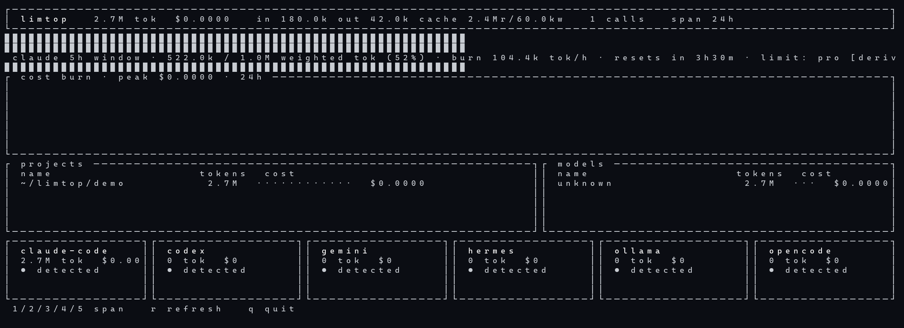
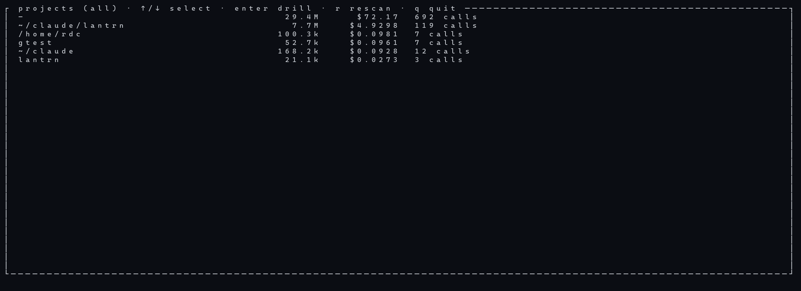
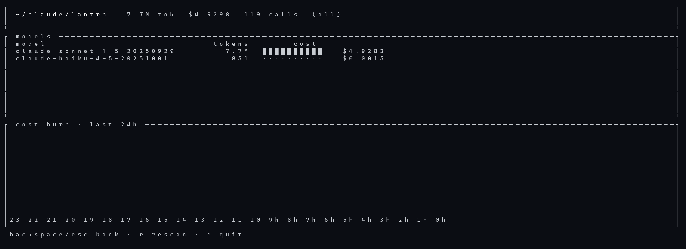
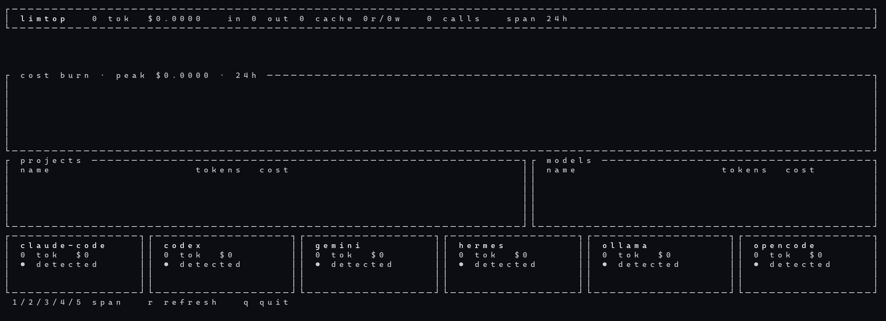

# limtop

**btop for AI usage.** A single Rust binary that reads the CLI coding agents
you already use — Claude Code, opencode, Hermes — and shows tokens, cost,
cache behavior, and burn-rate in one terminal dashboard. No server, no
account, no telemetry: everything is read from local files on disk.

## Why

Every AI usage tracker in 2026 is a menu-bar app or a web dashboard. If you
live in a terminal over SSH — on a server, in tmux, in a container — there's
nothing. `limtop` is the missing one: `cargo install limtop`, run it anywhere,
see everything.

## Screenshots

| | |
|---|---|
|  |  |
|  |  |

## Install

    # Homebrew (macOS / Linuxbrew)
    brew install cthulhutoo/limtop/limtop

    # Cargo (once published on crates.io)
    cargo install limtop

    # From source
    git clone https://github.com/cthulhutoo/limtop && cd limtop && cargo install --path .

## Providers

| Provider | Source | Status |
|----------|--------|--------|
| Claude Code | `~/.claude/projects/**/*.jsonl` | working |
| Codex | `~/.codex/` (sqlite + rollout JSONL) | working |
| Gemini CLI | `~/.gemini/tmp/*/chats/*.jsonl` | working |
| Hermes Agent | `~/.hermes/state.db` | working |
| opencode | `~/.local/share/opencode/storage/` | working |
| Ollama | local API + journald | working (call counts) |

limtop auto-discovers providers at startup and shows which ones it found.

## Rate-limit window

The dashboard shows a derived Claude 5-hour usage window: weighted tokens
consumed in the trailing 5h, burn rate, and when the oldest usage ages out.
Cache reads count at 0.1× weight, matching how limits bite.

Claude does not publish plan limits, so presets are community-observed
approximations. Pick yours with:

    LIMTOP_CLAUDE_LIMIT=pro|max5|max20|custom:<tokens>   limtop

Defaults to `pro`. The panel is labeled "derived" — it's a local estimate,
not an official reading.

## Usage

    limtop              # TUI dashboard
    limtop --dump       # plain-text report (pipes, CI, cron)
    limtop --dump --all # all-time report

In the TUI:

    1–5      switch span (1h / 24h / 7d / 30d / all)
    p        project drill-down (↑/↓ select, enter detail, backspace back)
    r        rescan providers
    q        quit

## Cost estimates

Costs are computed from a static pricing table (USD per million tokens,
cache reads at 0.1× input, cache writes at 1.25× input). When a provider
reports cost directly, that number is used instead. Local models (Ollama,
LM Studio) show $0.

## Privacy

limtop never makes a network request. All data comes from local session
files and provider state on your machine. There is no analytics, no
phone-home, no config file.

## License

MIT
